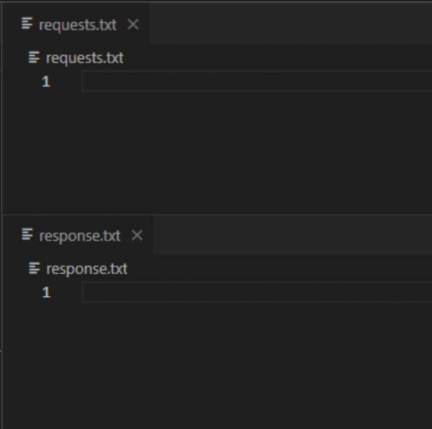
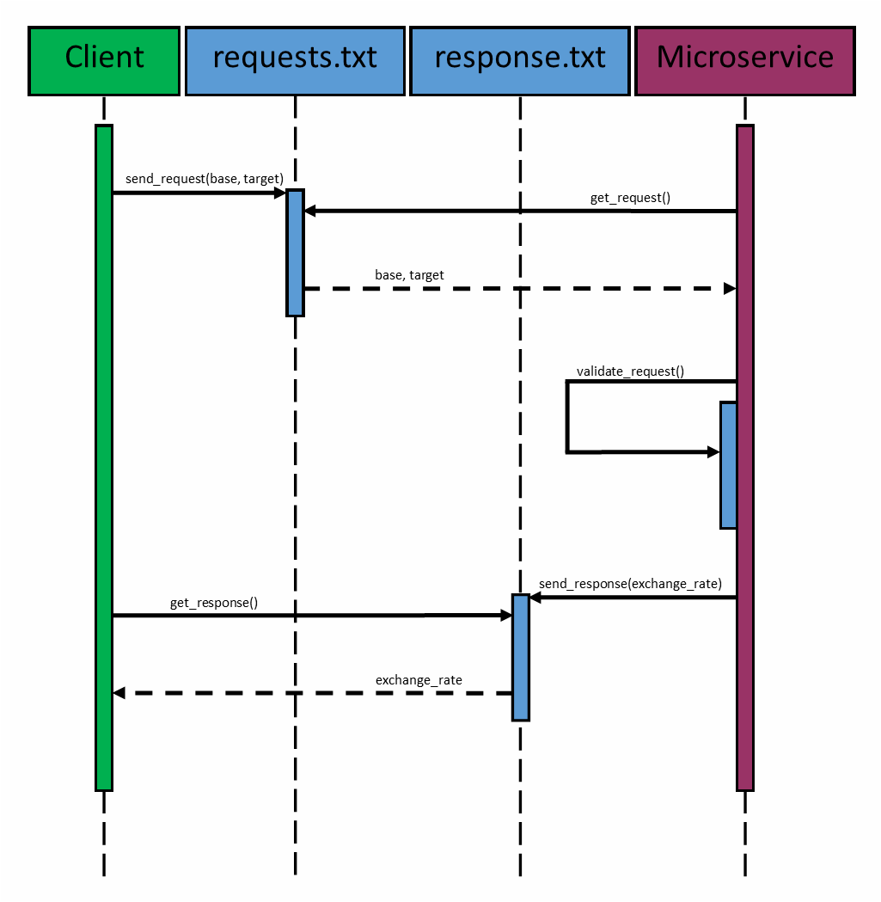

<div align="center">


# CS361: Currency Exchange Rate Microservice
### An accurate and Reliable Exchange Rate Service 

</div>
<br>

## Installation
To clone and run these files, you must have [Python 3.9+](https://www.python.org/downloads/release/python-390/) with IDLE or an alternative text editor, such as Atom or Visual Studio Code, installed on your local machine.

### Dependencies
This microservices requires the [requests 2.28+ python library](https://pypi.org/project/requests/).

### From the Termial
```bash
# Move to the desired install directory
cd Documents/GitHub

# Clone this repository
git clone https://github.com/4N0NYM0U5MY7H/CS361_Partner_Microservice

# Go into the microservice directory
cd CS361_Partner_Microservice/exchange_rate

# Install dependencies
python -m pip install requests

# Run the microservice
python main.py
```

### More Options:
For more cloning options, please visit the [GitHub Docs page for cloning a repository](https://docs.github.com/en/repositories/creating-and-managing-repositories/cloning-a-repository).

## Using the Microservice
### Sending a Request
Send a "`request`" to this microservice by updating `requests.txt` with two ISO 4217 Three Letter Currency Codes - e.g. `USD` for US Dollars, `EUR` for Euro etc. - separated by a comma.

> **Note**: Here's the list of [supported currency codes](https://www.exchangerate-api.com/docs/supported-currencies).

### Receving a Response
After a valid "`request`", the microservice will send a reponse to `response.txt` containing the exchange rate - e.g. request: `USD,EUR` response: `0.932527`.

### Animated Demo


### Sample Client in Python
```Python
# Simple example client to run with the Currency Exchange Microservice
import time
import re

# <path_to_requests_file> points to the request file in the microservice directory
path_to_requests_file = "exchange_rate/requests.txt"

# <path_to_response_file> points to the request file in the microservice directory
path_to_response_file = "exchange_rate/response.txt"

# example currencies to exchange
base_currency = "usd"
target_currency = "eur"

# Send the request to the <path_to_request_file>
with open(path_to_requests_file, "w") as out_file:
    out_file.write(f"{base_currency},{target_currency}")

# Poll the <path_to_response_file> until you receive a response
while True:
    time.sleep(1)
    # Receive the response from the <path_to_response_file>
    with open(path_to_response_file, "r") as in_file:
        exchange_rate = in_file.readline()

    # No response received
    if exchange_rate == "":
        continue

    # Valid reponse received
    if re.search("^(0|[1-9]\d*)?(\.\d+)?(?<=\d)$", exchange_rate):
        # acknowledge valid response in <path_to_response_file>
        with open(path_to_response_file, "w") as out_file:
            out_file.write("Response Received")
        break

# View the results
print(f"The exchange rate from USD to EUR is {exchange_rate}.")
```
```bash
# Expected Output
>>> The exchange rate from USD to EUR is 0.932527.
```

> **Note**: The microservice must be running BEFORE the client sends a request.

## Troubleshooting
* Check that you have [python 3.9+](https://www.python.org/downloads/release/python-390/) installed on your local machine
  ```bash
  python --version
  ```
* Check that you have [requests 2.28+](https://pypi.org/project/requests/) installed on your local machine
  ```bash
  python -m pip install requests
  ```
* Check that the `exchange_rate` folder is in the root of your project
  ```
  project
  |   README.md
  |   project files
  |   ...
  |___exchage_rate
  |   |   exchage_rate.py
  |   |   main.py
  |   |   requests.txt
  |   |   response.txt
  |
  |___folder
      |   folder files
      |   ...
      |
      |___subfolder
          |   subfolder files
          |   ...   
  ```
  * **Run the microservice from the `exhange_rate` directory**.
    ```bash
    # Move into the exchange_rate directory
    cd exchange_rate
    # Start the microservice
    python main.py
    ```
    * If you do NOT, then you will encounter issues related to the communication files.
        ```bash
        # DO NOT do this!
        python exchange_rate/main.py # Will cause issues with "requests.txt" and "response.txt"
        ``` 
* Check that your program is sending requests to `exchange_rate/requests.txt`
* Check that your program is receiving responses from `exchange_rate/response.txt`
  ```Python
  project
  |   ...
  |___exchage_rate
  |   |   ...
  |   |   requests.txt 
  |   |   response.txt
  
  # from project root
  path_to_requests_file = "exchange_rate/requests.txt"
  path_to_response_file = "exchange_rate/response.txt"
  ```
  ```Python
  project
  |   ...
  |___exchage_rate
  |   |   ...
  |   |   requests.txt
  |   |   response.txt
  |
  |___folder
      |   ...  
  
  # from project folder
  path_to_requests_file = "../exchange_rate/requests.txt"
  path_to_response_file = "../exchange_rate/response.txt"
  ```
  ```Python
  project
  |   ...
  |___exchage_rate
  |   |   ...
  |   |   requests.txt
  |   |   response.txt
  |
  |___folder
      |   ...
      |
      |___subfolder
          |   ...   

  # from project subfolder
  path_to_requests_file = "../../exchange_rate/requests.txt"
  path_to_response_file = "../../exchange_rate/response.txt"
  ```
  > **[Learn more about paths](https://www.redhat.com/sysadmin/linux-path-absolute-relative)**.

## Sequence Diagram


## Acknowledgements
This microservice would not be possible without the [Free and Open Access ExchangeRate-API](https://www.exchangerate-api.com/docs/free) endpoint.

## License
[MIT License](license)
