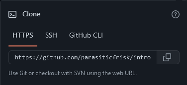

<div align="center">


# CS361: Currency Exchange Rate Microservice
### An accurate and Reliable Exchange Rate Service 

</div>

## Installation
<hr>

To clone and run these files, you must have [Python 3.9+](https://www.python.org/downloads/release/python-390/) with IDLE or an alternative text editor, such as Atom or Visual Studio Code, installed on your local machine.

### From the Termial
```bash
# Clone this repository
$ git clone https://github.com/4N0NYM0U5MY7H/CS361_Partner_Microservice

# Go into the directory
$ cd CS361_Partner_Microservice
```

### From the Browser
1. On GitHub.com, navigate to [this repository's main page]().
2. Above the list of files, click .
3. Choose the option that best fits your needs.

#### Option 1: Using `HTTPS`, `SSH`, or `GitHub CLI`
1. Copy the URL for the repository.
   * To clone this repository ussing HTTPS, under `HTTPS`, click .
   * To clone this repository using an SSH key, inlcuding a certificate issued by your organization's SSH certificate authority, click `SSH`, then click .
   * To clone this repository using GitHub CLI, click `GitHub CLI`, then click .
   
   
2. Open the Terminal.
3. Change the current directory to the location where you wish to clone this repository.
   ```bash
   # For example
   $ cd Documents/GitHub
   ```
4. Type `git clone`, and paste the URL you copied from the GitHub website.
   ```bash
   $ git clone https://github.com/4N0NYM0U5MY7H/CS361_Partner_Microservice
   ```

#### Option 2: Using `GitHub Desktop`
1. Click  to clone and open the repository with GitHub Desktop.
2. Follow the prompts in GitHub Desktop to complete the clone.

#### Option 3: Download the ZIP file
1. Click  to download and save this repository's master branch in a ZIP file.
2. Extract the files to the directory where you wish to clone this repository.

### More Options:
For more cloning options, please visit the [GitHub Docs page for cloning a repository](https://docs.github.com/en/repositories/creating-and-managing-repositories/cloning-a-repository).

## Dependencies
<hr>

This microservices requires the [requests 2.28+ python library](https://pypi.org/project/requests/).
```bash
# Install requests
$ python -m pip install requests
```

## Sending a Request
<hr>


## Receving a Request
<hr>

## Acknowledgements
<hr>

## License
<hr>